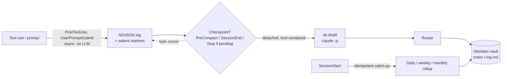

<div align="center">

# 🧠 SuperBrain

**Automatic Claude Code → Obsidian second brain. Install once, lift no finger.**

Every Claude Code session — across every project, on every machine — is captured into a plain Obsidian vault with smart routing and self-healing daily/weekly/monthly rollups. No API key. No daemon. No per-project setup.

[](LICENSE)
[](package.json)
[](#roadmap)
[](#development)
[](#vault-structure)

</div>

---

## Why

The Claude Code memory ecosystem has split in two, and neither half is what you actually want:

- **Automatic but opaque** (claude-mem, mcp-memory-service): great zero-config capture, but it lives in a SQLite/Chroma blob you can't browse, edit, or own.
- **Obsidian but manual** (basic-memory, claudesidian, obsidian-second-brain): a beautiful markdown vault, but *you* have to remember to run commands or hope the model decides to call a tool.

**No mature tool does all of:** globally installed → automatic capture → into a plain Obsidian vault → with time-based rollups → that you fully own and can `git`-sync. SuperBrain is that missing bridge.

The design — and the research and adversarial red-team behind every decision — lives in [`docs/superpowers/specs/`](docs/superpowers/specs/) and [`docs/superpowers/plans/`](docs/superpowers/plans/). This isn't vibes: ~23 prior-art projects and the current Claude Code platform were surveyed, and every architectural call was challenged before a line was written.

## Quick start

```bash
# In Claude Code:
/plugin marketplace add m3talux/superbrain
/plugin install superbrain

# Then once, in a terminal:
superbrain install                 # creates the data dir
superbrain migrate                 # optional: archives a legacy custom scribe (never deletes)
```

Installed at **user scope**, the plugin's hooks register for *every* project automatically. Point Obsidian at the vault (default `~/vault`, override with `SUPERBRAIN_VAULT`) and you're done. There is nothing else to do — ever.

## How it works



1. **Observe** — `PostToolUse` / `UserPromptSubmit` hooks append a compact event line to a per-session NDJSON log. **No LLM** on this path, so it can never rate-limit, stall, or disrupt your turn.
2. **Pin salience** — a deterministic scorer drops a structured marker into the log at the moments that matter (a commit, a file-churn spike, a context switch), so the later summary is anchored to *what happened* instead of re-derived from noise.
3. **Distill at checkpoints** — at `PreCompact`, `SessionEnd`, or a pending-gated `Stop`, one detached, lock-serialized `claude -p` reads the delta since a byte-offset cursor, classifies it, and writes routed notes via an in-process vault writer.
4. **Roll up** — on session start, missing daily/weekly/monthly summaries are caught up idempotently. Miss a day, sleep the laptop, skip a week — it self-heals on the next session.

## Features

**Phase 1 — capture spine (shipped, v0.1.0):**

- ✅ Globally installed, zero per-project setup, **no API key** (reuses your Claude Code auth)
- ✅ Automatic capture that does **not** degrade on multi-day sessions
- ✅ Plain Obsidian markdown — wikilinks, frontmatter, fully `git`-portable, zero lock-in
- ✅ Smart router: decisions / project facts / people / gotchas / triage capture
- ✅ Self-healing daily/weekly/monthly rollup catch-up — no cron, no daemon
- ✅ Append-or-create, **never** blind-overwrites a note you edited in Obsidian; soft-delete to `.trash/`
- ✅ Idempotent & resumable (byte cursor + `log.md`); silent failures surface once on next session
- ✅ One-command migration off a legacy custom scribe (archives, never deletes)

**Phase 2 — search & recall (shipped, v0.2.0):**

- ✅ Local hybrid search — FTS5 (BM25) + sqlite-vec, fused with Reciprocal Rank Fusion
- ✅ Tiered autonomous recall: BM25 pointers injected on **every prompt** (no model load, no daemon); full hybrid digest on session start
- ✅ `superbrain-recall` skill + stdio MCP server (`superbrain_search`) for model-invoked deep search
- ✅ Incremental index on write + self-healing reconcile on session start (Obsidian-edit / git-pull drift)
- ✅ All-local embeddings (MiniLM, fetched once & cached); automatic BM25 fallback — search is never hard-down

**Phase 2.1 — planned:** auto-generated Maps-of-Content (`maps/`) + Karpathy lint pass.

## Vault structure

```
~/vault/
├── projects/      one note per project — status, decisions, current focus
├── people/        one note per person — role, context, threads
├── decisions/     atomic, date-prefixed ADR-style notes
├── daily/         auto-written daily activity
├── capture/       raw inbound, triaged by rollups
├── maps/          auto-generated Maps-of-Content   (Phase 2.1)
├── index.md       catalog — the primary navigation surface
└── log.md         append-only, grep-parseable timeline
```

Generated files are namespaced so the rollup regenerator never touches notes you authored.

## Configuration

All optional — sensible defaults mean a clean install needs none.

| Variable | Default | Purpose |
|---|---|---|
| `SUPERBRAIN_VAULT` | `~/vault`, else `~/Documents/SuperBrain` | Where notes are written |
| `CLAUDE_PLUGIN_DATA` | `~/.superbrain` | Runtime state (cursors, queue, rollup state) |
| `ANTHROPIC_API_KEY` | *(unset)* | Optional escape hatch — distillation uses the API path instead of your subscription |

> **Heads-up (2026-06-15):** background `claude -p` / Agent-SDK usage on subscription plans draws from a separate capped monthly credit after this date. If captures stop, SuperBrain surfaces a one-time notice on session start — set `ANTHROPIC_API_KEY` to switch to the API path.

## Design principles

Enforced, tested invariants — not aspirations:

- **Never disrupt the session.** Every hook exits 0 no matter what; `PreCompact` never blocks compaction; a crashing hook is impossible by construction.
- **Never lose data.** Append-or-create only; a note you edited in Obsidian is never clobbered; deletes go to `.trash/`.
- **Never silently die.** Failures land in a sentinel surfaced once on the next `SessionStart`.
- **Idempotent & self-healing.** Byte cursor + grep-parseable log + hash-gated rollups; a missed or killed run is recovered next session.
- **No daemon, no scheduler, no API key.** One detached process per checkpoint — nothing to supervise, nothing to leak.

## Roadmap

| Phase | Scope | Status |
|---|---|---|
| **1 — Capture spine** | Observer, salience, checkpoint distiller, router, vault writer, rollup catch-up, migration | ✅ Shipped |
| **2 — Search & recall** | sqlite-vec + FTS5 hybrid search, autonomous `SessionStart`/`UserPromptSubmit` recall injection, `superbrain-recall` skill, MOC generation | ✅ Shipped (v0.2.0) |

Phase 2 gets its own spec → plan → review cycle, same as Phase 1.

## Development

```bash
npm install
npm run typecheck     # tsc --noEmit, zero errors
npm run build         # → dist/
npm test              # 52 tests across 21 files
```

Built test-first, task-by-task, with a two-stage (spec + code-quality) review on every unit and an independent end-to-end holistic review gate. The full implementation plan is in [`docs/superpowers/plans/`](docs/superpowers/plans/).

## Acknowledgements

Standing on the shoulders of: Andrej Karpathy's *LLM Wiki* pattern, [claude-mem](https://github.com/thedotmack/claude-mem) (global-plugin distribution + context injection), [basic-memory](https://github.com/basicmachines-co/basic-memory) (Obsidian-native markdown memory), [obsidian-second-brain](https://github.com/eugeniughelbur/obsidian-second-brain) (AI-first note rules), and [claude-memory-compiler](https://github.com/coleam00/claude-memory-compiler) (session-triggered rollups).

## License

[MIT](LICENSE) © m3talux
