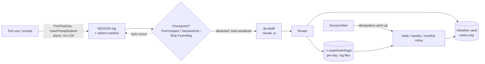

<div align="center">

# 🧠 SuperBrain

**Session memory for Claude Code — a second brain that builds itself.**

Every Claude Code session — across every project, on every machine — is captured into a plain Obsidian markdown vault you fully own. Zero config, no LLM of its own, no cloud. SuperBrain observes the sessions you're already running and writes the journal you never have time to.

[](LICENSE)
[](package.json)
[](https://github.com/m3talux/superbrain/actions/workflows/ci.yml)
[](#vault-structure)
[](https://obsidian.md)

</div>

---

> **Status:** in active development. Interfaces and behavior may change before a tagged release.

## Why

Every Claude Code session ends and the reasoning vanishes. Decisions, trade-offs, the "we tried X and it didn't work" history — gone with the terminal scrollback. CLAUDE.md fixes the *rules*; SuperBrain fixes the *journal*. The Claude Code memory ecosystem has split in two, and neither half is what you actually want:

- **Automatic but opaque** (claude-mem, mcp-memory-service): great zero-config capture, but it lives in a SQLite/Chroma blob you can't browse, edit, or own.
- **Obsidian but manual** (basic-memory, claudesidian, obsidian-second-brain): a beautiful markdown vault, but *you* have to remember to run commands or hope the model decides to call a tool.

**No mature tool does all of:** globally installed → automatic capture → into a plain Obsidian vault → with time-based rollups → that you fully own and can `git`-sync. SuperBrain is that missing bridge.

This isn't vibes: ~23 prior-art projects and the current Claude Code platform were surveyed, and every architectural decision was challenged before a line was written.

## Quick start

```text
# In Claude Code:
/plugin marketplace add m3talux/superbrain
/plugin install superbrain
```

That's it. On the **first session** the plugin runs a one-time setup (installs its
search dependencies in the background) and tells you it's doing so; capture is
fully active from the next session. SuperBrain writes to its own vault at
`~/.superbrain/vault` — a fixed, predictable location with no environment
variables to set. Point Obsidian at that folder and you're done.

If you already have an Obsidian vault you want to bring along, see
[Vault setup](#vault-setup) below — `/superbrain:migrate` is the preferred path.

Installed at **user scope**, the plugin's hooks register for *every* project automatically — there is nothing else to do, ever.

> If SuperBrain saves you context, please star ⭐ — it's the only signal we have.

## Supported platforms

- **macOS** — Apple Silicon + Intel. CI-tested.
- **Linux** — Ubuntu 22.04+ verified; other distros likely fine. CI-tested.
- **Windows** — native Windows support is in progress: the cross-platform
  spawn wrapper, path-separator handling, and platform-aware bootstrap hints
  are in place, but the test suite is not yet fully Windows-portable and
  Windows isn't on the CI matrix. See
  [Install troubleshooting](#install-troubleshooting) for the first-install
  failure modes and the fixes.

Tested on Node 20 LTS and Node 22.

## How it works



1. **Observe** — `PostToolUse` / `UserPromptSubmit` hooks append a compact event line to a per-session NDJSON log. **No LLM** on this path, so it can never rate-limit, stall, or disrupt your turn.
2. **Pin salience** — a deterministic scorer drops a structured marker into the log at the moments that matter (a commit, a file-churn spike, a context switch), so the later summary is anchored to *what happened* instead of re-derived from noise.
3. **Distill at checkpoints** — at `PreCompact`, `SessionEnd`, or a pending-gated `Stop`, one detached, lock-serialized `claude -p` reads the delta since a byte-offset cursor, classifies it, and writes routed notes via an in-process vault writer.
4. **Roll up** — on session start, missing daily/weekly/monthly summaries are caught up idempotently. Miss a day, sleep the laptop, skip a week — it self-heals on the next session.

## Features

**Capture**

- ✅ Globally installed, zero per-project setup, **no API key** (reuses your Claude Code auth)
- ✅ **One-shot project discovery** on first session in an unknown repo: walks the tree, reads the manifests + CLAUDE.md + README, asks one Sonnet call to produce a substantive `projects/<slug>.md` (stack / architecture / top-level folders / key files / docs / conventions / open questions). Once per project, ever. Never overwrites an existing note.
- ✅ Automatic capture that does **not** degrade on multi-day sessions
- ✅ Plain Obsidian markdown — wikilinks, frontmatter, fully `git`-portable, zero lock-in
- ✅ Smart router: decisions / project facts / people / gotchas / triage capture
- ✅ Self-healing daily/weekly/monthly rollup catch-up — no cron, no daemon
- ✅ Append-or-create, **never** blind-overwrites a note you edited in Obsidian; soft-delete to `.trash/`
- ✅ Idempotent & resumable (byte cursor + per-day `~/.superbrain/logs/<date>.log` files); silent failures surface once on next session
- ✅ One-command migration off a legacy custom scribe (archives, never deletes)

**Search & recall**

- ✅ Local hybrid search — FTS5 (BM25) + sqlite-vec, fused with Reciprocal Rank Fusion
- ✅ Tiered autonomous recall: BM25 pointers injected on **every prompt** (no model load, no daemon); full hybrid digest on session start
- ✅ `superbrain-recall` skill + stdio MCP server (`superbrain_search`) for model-invoked deep search
- ✅ Incremental index on write + self-healing reconcile on session start (Obsidian-edit / git-pull drift)
- ✅ All-local embeddings (MiniLM, fetched once & cached); automatic BM25 fallback — search is never hard-down

**Personalization & journaling**

- ✅ Daily notes — hybrid digest + linked index, idempotently regenerated per day
- ✅ Lessons — durable, generalizable rules learned from your pushback
- ✅ Preferences — a deduplicated profile auto-injected at SessionStart (never edits your `CLAUDE.md`)

**Planned**

- Auto-generated Maps-of-Content (`maps/`) + a lint pass.

## Manual capture with `/superbrain:inject`

Auto-capture handles everything SuperBrain can observe inside a Claude session. When you want to record something it didn't see — a random side thought, a meeting summary from elsewhere, a note imported from another system — use the inject command:

```
/superbrain:inject I just realized the auth-config endpoint probably needs a TTL field
/superbrain:inject --from-file ~/Downloads/meeting-summary.md
/superbrain:inject --project wcloud "transport is HTTP, not gRPC"
```

What it does:

- **Short single-blob input** lands verbatim in `capture/`. No LLM call.
- **Longer or multi-topic input** is split via SuperBrain's inject distiller into the right files: decisions to `decisions/`, project facts to the matching `projects/<slug>.md`, references to people to `people/`, everything else to `capture/`.
- Today's daily note is updated either way.
- Every injected note carries `source: inject` provenance so it's trivially auditable.

Safety rails: inject never creates new project notes (use `/superbrain:discover` for that), never reshapes preferences, and never silently loses your input — if the distiller returns nothing, your text is written verbatim to `capture/`.

## Vault structure

```
~/.superbrain/vault/
├── projects/      one note per project — status, decisions, current focus
├── people/        one note per person — role, context, threads
├── decisions/     atomic, date-prefixed ADR-style notes
├── daily/         auto-written daily activity
├── lessons/       durable, generalizable rules learned from your pushback
├── capture/       raw inbound, triaged by rollups
├── meta/          preferences.md — deduplicated profile auto-injected at SessionStart
├── maps/          auto-generated Maps-of-Content   (planned)
└── index.md       catalog — the primary navigation surface
```

System telemetry (NOT in the vault — lives next to it in `~/.superbrain/`):

```
~/.superbrain/
├── logs/<date>.log    per-day append-only write log; powers the daily rollup
├── sessions/          per-session NDJSON event streams + cursors
├── transcripts/       full session transcripts (when captured)
├── index.db           hybrid search index (FTS5 + sqlite-vec)
└── rollup-state.json  hash-gated rollup convergence state
```

Generated files are namespaced so the rollup regenerator never touches notes you authored.

## Vault setup

SuperBrain's vault lives at `~/.superbrain/vault` — fixed, predictable, no env vars. Two ways to bring an existing Obsidian vault into the picture:

### Migrate (preferred)

```text
/superbrain:migrate                  # auto-detects your vault
/superbrain:migrate ~/Documents/MyVault   # explicit path
/superbrain:migrate --dry-run        # preview without writing
```

`/superbrain:migrate` reads your existing Obsidian vault (the source is **never modified**) and copies its content into `~/.superbrain/vault`, fitting it into SuperBrain's structure (`projects/`, `decisions/`, `people/`, `daily/`, etc.). From then on, SuperBrain owns and extends a vault it fully understands — its router, rollups, and index all behave predictably. **This is the recommended path** for almost every user.

### Adopt (advanced — only when migration isn't an option)

```text
/superbrain:adopt ~/Documents/MyEstablishedVault
```

`/superbrain:adopt` does **not** copy anything; it records your existing path as the vault location and starts writing into it directly. Use this only when you have a heavily established Obsidian setup whose structure you do not want to change — broken into folders, plugins, layouts, or conventions SuperBrain isn't designed around.

The trade-off: SuperBrain will work *on top of* whatever's already there rather than *alongside* a structure it owns. The router may write into folders that don't match your existing convention; rollups will live alongside your hand-authored notes; the search-index reconciler will still self-heal but has more drift to manage. Migration sidesteps all of that.

When in doubt: **migrate, don't adopt.**

## Configuration

SuperBrain is configured by command, not by environment. There are no
required env vars. The single optional one:

| Variable | Purpose |
|---|---|
| `ANTHROPIC_API_KEY` | Optional escape hatch — distillation uses the Anthropic API instead of your Claude Code subscription. Useful if you want the distill/rollup spawns to bypass subscription quota. |

> **Heads-up (2026-06-15):** background `claude -p` / Agent-SDK usage on subscription plans draws from a separate capped monthly credit after this date. If captures stop, SuperBrain surfaces a one-time notice on session start — set `ANTHROPIC_API_KEY` to switch to the API path.

## Syncing your vault

SuperBrain **deliberately does not push your vault anywhere.** It writes plain
markdown into a local folder and nothing leaves the machine. This is a design
choice, not a missing feature: a network operation in the capture path could
hang, stall on an auth prompt, or fail — exactly the failure mode the
"never disrupt the session" guarantee exists to prevent. Backup and
multi-machine sync are a solved problem, and dedicated tools do it better and
safer than a hook can.

What SuperBrain *does* guarantee is that it composes cleanly with whatever sync
you choose: writes are append-or-create and idempotent, and the search index
**self-heals on session start** after the vault changes underneath it (an
external `git pull`, an Obsidian edit, a Syncthing update). So you can layer any
of the following on top with no special configuration:

- **Adopted an existing Obsidian vault?** If it's already backed by the
  [Obsidian Git](https://github.com/Vinzent03/obsidian-git) community plugin (or
  Obsidian Sync), you already have sync — SuperBrain just writes into it and
  your existing setup ships the changes. Nothing to do.
- **Using the owned default (`~/.superbrain/vault`)?** Pick one:
  - Make it a git repo and use **Obsidian Git** for scheduled commit/push.
  - Point **Syncthing** or a file-sync tool at the folder.
  - Or a DIY scheduled job — e.g. a `cron` / `launchd` entry running, say every
    15 minutes:

    ```bash
    cd ~/.superbrain/vault && git add -A \
      && git commit -q -m "vault sync $(date -u +%FT%TZ)" \
      && git pull --rebase --autostash && git push
    ```

Whichever you choose, treat it as **backup / sync owned by you**, not by the
plugin. Running the same vault from two machines concurrently can still produce
git conflicts in regenerated files (`index.md`, rollups) — Obsidian
Git's conflict UX or a single-writer-at-a-time habit avoids that. SuperBrain's
job is to stay idempotent and drift-tolerant so any of these Just Work; it is
not to own your remote.

## Install troubleshooting

SuperBrain runs a one-time `npm ci` + `npm rebuild better-sqlite3` on first session start. If `~/.superbrain/last-failure.txt` reports a bootstrap failure, the message includes a platform-specific hint. Common cases:

- **`npm ci` failed** — network / proxy issue. Retry. If you're behind a corporate proxy, configure `npm config set proxy ...` and retry.
- **better-sqlite3 native build failed (Windows)** — install [Visual Studio Build Tools](https://github.com/nodejs/node-gyp#on-windows) + Python 3 and retry, or switch to Node 20 LTS which has more prebuilt binaries.
- **better-sqlite3 native build failed (Linux)** — `sudo apt install build-essential python3` and retry.
- **better-sqlite3 native build failed (macOS)** — `xcode-select --install` and retry.
- **better-sqlite3 binding wouldn't load under your Node version** — Node 25's ABI 141 has no published prebuild at the time of writing; downgrade to Node 22 or 20 LTS.

SuperBrain re-tries bootstrap on every session start, so once the underlying issue is fixed, the next session picks it up automatically.

## Design principles

Enforced, tested invariants — not aspirations:

- **Never disrupt the session.** Every hook exits 0 no matter what; `PreCompact` never blocks compaction; a crashing hook is impossible by construction.
- **Never lose data.** Append-or-create only; a note you edited in Obsidian is never clobbered; deletes go to `.trash/`.
- **Never silently die.** Failures land in a sentinel surfaced once on the next `SessionStart`.
- **Idempotent & self-healing.** Byte cursor + grep-parseable log + hash-gated rollups; a missed or killed run is recovered next session.
- **No daemon, no scheduler, no API key.** One detached process per checkpoint — nothing to supervise, nothing to leak.

## Development

```bash
npm ci
npm run typecheck     # tsc --noEmit, zero errors
npm run build         # → dist/
npm test              # full suite (unit + integration + fresh-clone E2E)
npm run release:check # build is reproducible: committed dist/ matches source
```

Contributions welcome — see [CONTRIBUTING.md](CONTRIBUTING.md).

## Acknowledgements

Standing on the shoulders of: Andrej Karpathy's *LLM Wiki* pattern, [claude-mem](https://github.com/thedotmack/claude-mem) (global-plugin distribution + context injection), [basic-memory](https://github.com/basicmachines-co/basic-memory) (Obsidian-native markdown memory), [obsidian-second-brain](https://github.com/eugeniughelbur/obsidian-second-brain) (AI-first note rules), and [claude-memory-compiler](https://github.com/coleam00/claude-memory-compiler) (session-triggered rollups).

## License

[MIT](LICENSE) © m3talux
